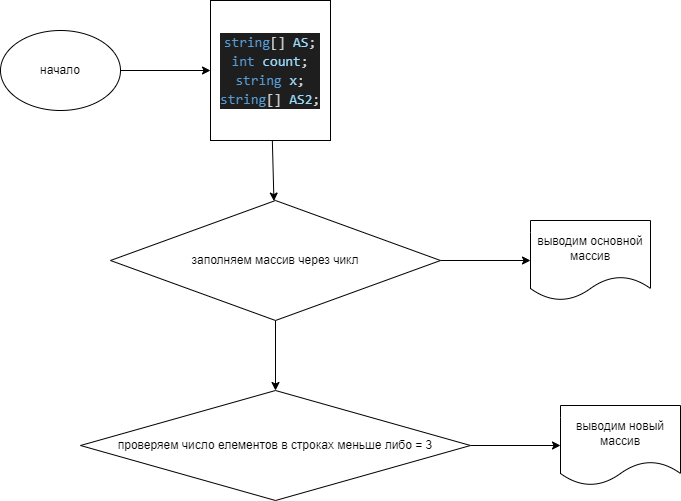

# Итоговое практическое задание 
    Для решения задачи создал 2 массива типа string чтобы можно было по средствам замещения элементов заполнять массив пользоваителем через терминал и после вывести его единой строкой через ";" в терминале.
***
**Во второй части для выведения строк из 3 и менее символов использовал запрос пространства имен Linq, это горазд проще и быстрее позволяет выполнить поставленную задачу.**

* так же был использован метод списка для сравнения

## *Схемка!*

### ***Будем учиться дальше!!!***